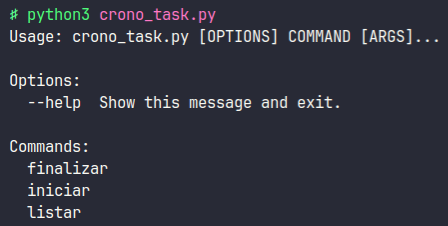
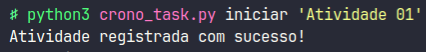
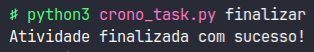
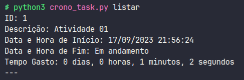

# Crono Task

## Table of Contents

- [Crono Task](#crono-task)
  - [Table of Contents](#table-of-contents)
  - [About ](#about-)
  - [Getting Started ](#getting-started-)
    - [Prerequisites](#prerequisites)
    - [Installing](#installing)
  - [Usage ](#usage-)
    - [Exemplos de execução](#exemplos-de-execução)
      - [iniciar](#iniciar)
      - [finalizar](#finalizar)
      - [listar](#listar)

## About <a name = "about"></a>

CLI para contabilizar a quantidade de tempo gasto com as suas atividades

## Getting Started <a name = "getting_started"></a>

### Prerequisites

```programs
Python3
MySQL
```

### Installing

Para executar o script é necessário os seguintes passos:

1. Instalar conector mysql do python com o seguinte comando:

```bash
pip install mysql-connector-python
```

2. Criar a base de dados no MySQL, chamada `horas_atividades` e alterar as informações de acesso ao banco de dados no script

## Usage <a name = "usage"></a>

A CLI possui três funcionalidades: iniciar, finalizar e listar
Ao executar a funcionalidade `iniciar` deve-se passar como parâmetro a descrição da atividade.



### Exemplos de execução

#### iniciar

```python
python3 crono_task.py iniciar 'Development: implementar funcionalidade X'
```



#### finalizar

OBS: Se existir mais de uma atividade inicializada, as mesmas serão finalizadas na ordem inversa de criação.

```python
python3 crono_task.py finalizar
```



#### listar

```python
python3 crono_task.py listar
```


